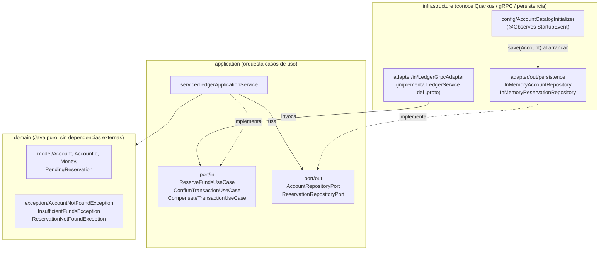

# account-ledger-service

Microservicio **Core Contable** (Ledger) del ecosistema transaccional distribuido
*Fund Transfer Engine*. Es el segundo de dos microservicios — el primero,
`transaction-orchestrator-service`, actúa como Gateway/Orquestador de Saga y es el
único punto de entrada externo. `account-ledger-service` está **cerrado al
exterior**: solo responde peticiones gRPC internas del orquestador y nunca expone
una API REST pública.

---

## Tabla de contenido

1. [Arquitectura](#arquitectura)
2. [Stack tecnológico](#stack-tecnológico)
3. [ADR (Architecture Decision Record)](#adr-architecture-decision-record)
4. [Catálogo de cuentas inicial](#catálogo-de-cuentas-inicial)
5. [Simulación de fallos](#simulación-de-fallos)
6. [Contrato gRPC](#contrato-grpc)
7. [Cómo ejecutar el proyecto](#cómo-ejecutar-el-proyecto)
8. [Testing](#testing)
9. [Health Checks y Observabilidad](#health-checks-y-observabilidad)
10. [Estructura de carpetas](#estructura-de-carpetas)
11. [Supuestos y ambigüedades asumidas](#supuestos-y-ambigüedades-asumidas)
12. [Pendiente / Fuera de alcance](#pendiente--fuera-de-alcance)

---

## Arquitectura

El servicio sigue **Arquitectura Hexagonal (Puertos y Adaptadores)**. El dominio y
la capa de aplicación son Java puro, sin ninguna dependencia de framework
(ni Quarkus, ni gRPC, ni anotaciones de infraestructura). Solo la capa de
`infrastructure` conoce Quarkus, Mutiny-gRPC y el almacenamiento concreto.



**Regla de dependencia (Dependency Inversion Principle):** las flechas de
implementación (`-.implementa.->`) siempre apuntan desde `infrastructure` hacia
`application`, nunca al revés. `LedgerApplicationService` (capa `application`)
solo conoce las interfaces `AccountRepositoryPort` / `ReservationRepositoryPort`;
no sabe si detrás hay un `ConcurrentHashMap` en memoria, una base de datos o un
mock de test. Esto permite sustituir la persistencia en memoria por una real
(Postgres, Redis, etc.) sin tocar una sola línea de dominio o de casos de uso.

| Carpeta | Contenido | Por qué está ahí |
|---|---|---|
| `domain/model` | `Account`, `AccountId`, `Money`, `PendingReservation` | Entidades e invariantes de negocio puros (validación de montos, transiciones de saldo). Cero anotaciones de framework. |
| `domain/exception` | `AccountNotFoundException`, `InsufficientFundsException`, `ReservationNotFoundException` | Errores de negocio, independientes de cómo se transportan (gRPC, HTTP, etc.). |
| `application/port/in` | `ReserveFundsUseCase`, `ConfirmTransactionUseCase`, `CompensateTransactionUseCase` | Contratos de los casos de uso que la infraestructura de entrada puede invocar. |
| `application/port/out` | `AccountRepositoryPort`, `ReservationRepositoryPort` | Contratos que la aplicación necesita de la infraestructura de salida (persistencia). |
| `application/service` | `LedgerApplicationService` | Implementa los tres puertos de entrada orquestando el dominio y los puertos de salida. |
| `infrastructure/adapter/in` | `LedgerGrpcAdapter` | Adapta el contrato gRPC (`ledger.proto`) a los casos de uso. Traduce excepciones de dominio a `Status` del `.proto`. |
| `infrastructure/adapter/out/persistence` | `InMemoryAccountRepository`, `InMemoryReservationRepository` | Implementación en memoria (`ConcurrentHashMap`) de los puertos de salida. |
| `infrastructure/config` | `AccountCatalogInitializer` | Siembra el catálogo de cuentas inicial al arrancar (`StartupEvent`). |

---

## Stack tecnológico

Tomado directamente de `pom.xml`:

| Componente | Versión / detalle |
|---|---|
| Java | 21 (`maven.compiler.release=21`) |
| Quarkus BOM | `3.38.1` |
| Empaquetado | `quarkus` (packaging nativo del plugin Maven de Quarkus) |
| Programación reactiva | SmallRye Mutiny (`Uni<T>`), vía `quarkus-grpc` |
| Comunicación | `quarkus-grpc` (gRPC + protobuf) |
| Validación | `quarkus-hibernate-validator` |
| Salud/Observabilidad | `quarkus-smallrye-health` |
| Inyección de dependencias | `quarkus-arc` (CDI) |
| Configuración | `quarkus-config-yaml` (`application.yml`) |
| Boilerplate | Lombok `1.18.34` (`@Getter`, `@Value`, `@Slf4j`, `@RequiredArgsConstructor`, etc.) |
| Tests | `quarkus-junit5`, `quarkus-junit5-mockito`, `rest-assured` |

---

## ADR (Architecture Decision Record)

### 1. Programación reactiva (Mutiny) en vez de Hilos Virtuales

A diferencia del orquestador (`transaction-orchestrator-service`), que puede
permitirse hilos virtuales porque coordina llamadas a *distintos* recursos
externos, este servicio concentra la contención sobre un **único recurso
compartido**: el saldo de una cuenta (`Account`). Bajo carga concurrente, muchas
peticiones de `ReserveFunds` pueden apuntar simultáneamente a la misma
`AccountId`. Un modelo reactivo con `Uni<T>` permite:

- Componer la cadena `findById → reserve → save` sin bloquear el hilo del
  event loop mientras se espera I/O (relevante en cuanto la persistencia en
  memoria se sustituya por una real).
- Backpressure y control explícito del flujo de fallos (`onFailure().recoverWithItem(...)`
  en `LedgerGrpcAdapter`) sin `try/catch` imperativo disperso por la capa de
  aplicación.
- Mantener el mismo modelo de concurrencia que expone `quarkus-grpc` de forma
  nativa (los stubs generados devuelven `Uni<T>`), evitando una capa de
  adaptación entre hilos virtuales y reactividad.

### 2. Concurrencia lock-free (CAS) en `Account` en vez de `synchronized`

`Account` usa `AtomicReference<Money>` con `compareAndSet` en bucle
(`do { ... } while (!availableBalance.compareAndSet(current, updated))`) en vez
de bloques `synchronized`. En un modelo reactivo, un hilo que se bloquea en un
`synchronized` mientras espera un lock retiene ese hilo del **event loop**
(o del pool reactivo), lo que puede degradar el throughput de todo el servicio
bajo contención, no solo de esa cuenta. CAS permite que los hilos reintenten sin
bloquear, evitando ese acoplamiento entre contención de negocio y capacidad de
procesamiento reactivo. El trade-off asumido es el reintento en bucle bajo alta
contención (aceptable dado que la sección crítica es aritmética pura sobre
`BigDecimal`, no I/O).

### 3. `.proto` duplicado en cada servicio en vez de un módulo `contracts` compartido

`ledger.proto` vive dentro de `account-ledger-service/src/main/proto`, y
presumiblemente una copia equivalente existe en `transaction-orchestrator-service`.
Se optó por duplicar el contrato en vez de extraerlo a un módulo/librería
`contracts` compartida por dos razones:

- **Independencia de despliegue**: cada servicio se compila, versiona y despliega
  sin depender de publicar/consumir un artefacto intermedio.
- **Alcance de la prueba técnica**: introducir un módulo compartido (o un
  registro de esquemas tipo Buf Schema Registry) añade infraestructura de
  build que no aporta valor demostrativo dentro del ejercicio.

El trade-off reconocido es la pérdida de una única fuente de verdad: si el
contrato cambia, hay que actualizarlo en los dos repos manualmente. En un
entorno productivo real, este `.proto` viviría en un **registro de esquemas
compartido** (Buf Schema Registry, un repositorio Git `contracts` versionado
semánticamente, o un artefacto Maven publicado desde un pipeline dedicado).

### 4. `PendingReservation` como memoria de la reserva

Los mensajes `ConfirmTransactionRequest` y `CompensateTransactionRequest` del
`.proto` **solo llevan `transaction_id`** (y `reason` en el caso de
compensación) — no cuentas ni montos. Sin embargo, para confirmar un débito o
revertir una reserva, el Ledger necesita saber *qué cuenta origen*, *qué cuenta
destino* y *qué monto* corresponden a esa transacción.

`PendingReservation` (guardado por `ReservationRepositoryPort` al ejecutar
`ReserveFunds`) resuelve esto actuando como el estado intermedio de una
**saga**: al reservar fondos, el Ledger persiste
`(transactionId, sourceAccountId, targetAccountId, amount)`. Cuando llega
`ConfirmTransaction` o `CompensateTransaction` con solo el `transactionId`, el
servicio recupera esa reserva pendiente y con ella sabe exactamente qué cuentas
debitar/acreditar o qué reserva liberar. Al confirmar o compensar, la reserva se
elimina del repositorio (`remove(transactionId)`), evitando doble-procesamiento.

---

## Catálogo de cuentas inicial

Sembrado por `AccountCatalogInitializer`, que observa `StartupEvent` y llama a
`InMemoryAccountRepository.save(...)` al arrancar la aplicación:

| AccountId | Saldo disponible inicial |
|---|---|
| `ACC-100` | $1,000.00 |
| `ACC-200` | $500.00 |

```java
void onStart(@Observes StartupEvent event) {
    accountRepository.save(new Account(AccountId.of("ACC-100"), Money.of(new BigDecimal("1000.00"))));
    accountRepository.save(new Account(AccountId.of("ACC-200"), Money.of(new BigDecimal("500.00"))));
}
```

Al ser un repositorio en memoria (`ConcurrentHashMap`), este catálogo se
reinicia en cada arranque de la aplicación (no persiste entre reinicios).

---

## Simulación de fallos

`LedgerApplicationService` define:

```java
private static final double SIMULATED_FAILURE_RATE = 0.25;
```

En `confirm(String transactionId)`, antes de tocar cualquier repositorio, se
genera un número aleatorio (`ThreadLocalRandom.current().nextDouble()`) y, con
**25% de probabilidad**, el método falla inmediatamente con una
`RuntimeException("UNAVAILABLE: fallo simulado en ConfirmTransaction")` — sin
consultar la reserva ni tocar las cuentas.

Esto es **intencional**, no un bug: forma parte del diseño del reto para forzar
que `transaction-orchestrator-service` detecte el fallo (vía su Circuit
Breaker/Retry) y active su política de compensación (`CompensateTransaction`)
sobre la reserva que quedó pendiente. Por eso, en `LedgerGrpcAdapter`, este
fallo **no se captura** con `.onFailure(...).recoverWithItem(...)` como sí ocurre
con `InsufficientFundsException` o `ReservationNotFoundException`: se deja
propagar como error gRPC real.

Cómo observarlo:
- En logs, aparece el `log.warn("Fallo simulado en ConfirmTransaction para transacción {}", transactionId)`.
- Al invocar `ConfirmTransaction` repetidamente sobre transacciones reservadas,
  aproximadamente 1 de cada 4 intentos fallará sin tocar el estado de las
  cuentas ni eliminar la reserva pendiente (por lo que un reintento posterior
  sobre el mismo `transactionId` puede confirmar exitosamente).

---

## Contrato gRPC

Definido en `src/main/proto/ledger.proto`, servicio `LedgerService` con 3 RPCs:

| RPC | Request | Response | Descripción |
|---|---|---|---|
| `ReserveFunds` | `ReserveFundsRequest` | `ReserveFundsResponse` | Reserva `amount` en `source_account` para transferir a `target_account`, registrando una `PendingReservation`. |
| `ConfirmTransaction` | `ConfirmTransactionRequest` | `ConfirmTransactionResponse` | Confirma el débito en la cuenta origen y el crédito en la cuenta destino de una reserva previa. Sujeto al fallo simulado del 25%. |
| `CompensateTransaction` | `CompensateTransactionRequest` | `CompensateTransactionResponse` | Libera (revierte) una reserva pendiente, devolviendo el monto reservado al saldo disponible de la cuenta origen. |

```protobuf
message ReserveFundsRequest {
  string transaction_id = 1;
  string source_account = 2;
  string target_account = 3;
  double amount = 4;
  string currency = 5;
}

message ConfirmTransactionRequest {
  string transaction_id = 1;
}

message CompensateTransactionRequest {
  string transaction_id = 1;
  string reason = 2;
}

enum Status {
  STATUS_UNKNOWN = 0;
  STATUS_RESERVED = 1;
  STATUS_CONFIRMED = 2;
  STATUS_INSUFFICIENT_FUNDS = 3;
  STATUS_COMPENSATED = 4;
  STATUS_UNAVAILABLE = 5;
}
```

Mapeo de excepciones de dominio → `Status` (en `LedgerGrpcAdapter`):

| Excepción de dominio | `Status` devuelto |
|---|---|
| `InsufficientFundsException` | `STATUS_INSUFFICIENT_FUNDS` |
| `AccountNotFoundException` | `STATUS_UNKNOWN` |
| `ReservationNotFoundException` | `STATUS_UNKNOWN` |
| Fallo simulado en `ConfirmTransaction` | *no se mapea*: se propaga como error gRPC (no hay respuesta `Status` — el cliente recibe una falla de RPC) |

> `STATUS_UNAVAILABLE` está declarado en el enum del `.proto` pero actualmente
> **no se emite** desde `LedgerGrpcAdapter` (ver [Pendiente / Fuera de alcance](#pendiente--fuera-de-alcance)).

---

## Cómo ejecutar el proyecto

### Requisitos

- Java 21+
- No requiere Maven instalado: el repositorio incluye el Maven Wrapper (`mvnw` / `mvnw.cmd`).

### Modo desarrollo (live reload)

```bash
./mvnw quarkus:dev
```

En Windows:

```bash
mvnw.cmd quarkus:dev
```

### Puertos

| Puerto | Protocolo | Uso |
|---|---|---|
| `8081` | HTTP | Solo health checks y métricas (no expone REST de negocio) |
| `9001` | gRPC | Servidor gRPC (`use-separate-server: true` en `application.yml`) |

### Correr los tests

```bash
./mvnw test
```

### Compilar el JAR

```bash
./mvnw package
```

### Native Image (GraalVM)

```bash
./mvnw package -Dnative
```

El `pom.xml` define un perfil `native` (`quarkus.native.enabled=true`,
`quarkus.package.jar.enabled=false`, `skipITs=false`) que compila un binario
nativo con GraalVM. El beneficio principal en un clúster EKS es el
**cold-start prácticamente instantáneo** (milisegundos vs. segundos de una JVM),
relevante para escalado horizontal agresivo (HPA) o *scale-to-zero*, además de
un footprint de memoria significativamente menor por pod.

---

## Testing

| Capa | Archivo | Qué cubre |
|---|---|---|
| Dominio | `domain/model/MoneyTest` | Creación válida, rechazo de montos nulos/negativos, suma, resta, resta que resultaría negativa, comparación, igualdad por valor. |
| Dominio | `domain/model/AccountTest` | Reserva con saldo suficiente/insuficiente, confirmación de débito, crédito, liberación (compensación), invariante de saldo total, **concurrencia con 100 hilos** reservando sobre la misma cuenta para verificar que el CAS no permite condiciones de carrera. |
| Aplicación (casos de uso) | `application/service/LedgerApplicationServiceTest` | `reserve`, `confirm` y `compensate` de `LedgerApplicationService` con los puertos de salida simulados vía `@InjectMock` (Mockito) sobre un contexto `@QuarkusTest` real. Incluye el camino feliz, fondos insuficientes, reserva inexistente, y una estrategia de reintento en el test para saltar el fallo simulado del 25% en `confirm` y validar el resultado de negocio real subyacente. |
| Infraestructura (persistencia) | `infrastructure/adapter/out/persistence/InMemoryAccountRepositoryTest` | Cuenta sembrada al arrancar (`ACC-100`), guardar/recuperar una cuenta nueva, fallo `AccountNotFoundException` para una cuenta inexistente. |
| Infraestructura (persistencia) | `infrastructure/adapter/out/persistence/InMemoryReservationRepositoryTest` | Guardar/recuperar una reserva, fallo `ReservationNotFoundException` para una reserva inexistente, y que una reserva eliminada deja de encontrarse. |
| Infraestructura (gRPC, integración) | `infrastructure/adapter/in/LedgerGrpcAdapterIT` | `@QuarkusTest` con `@GrpcClient` real contra el servidor gRPC embebido: `ReserveFunds` (éxito, cuenta inexistente, fondos insuficientes), `ConfirmTransaction` (éxito con reintento sobre el fallo simulado, reserva inexistente) y `CompensateTransaction` (éxito, reserva inexistente). |

Ejecutar toda la suite:

```bash
./mvnw test
```

> Nota: los tests de `LedgerApplicationServiceTest`, los de persistencia y
> `LedgerGrpcAdapterIT` corren todos bajo `@QuarkusTest`, compartiendo la misma
> instancia de aplicación (y por tanto el mismo catálogo de cuentas en memoria)
> dentro de una misma ejecución continua de tests — de ahí que cada test use
> `transactionId`/montos propios para no interferir entre sí.

---

## Health Checks y Observabilidad

Expuestos por `quarkus-smallrye-health` sobre el puerto HTTP `8081`:

| Ruta | Propósito |
|---|---|
| `/q/health/live` | *Liveness probe* — indica si el proceso sigue vivo. |
| `/q/health/ready` | *Readiness probe* — indica si el servicio está listo para recibir tráfico (incluye el estado del servidor gRPC). |
| `/q/health` | Agregado de liveness + readiness. |

En Kubernetes, estas rutas se referencian típicamente como `livenessProbe` y
`readinessProbe` en el manifiesto del Deployment, apuntando al puerto `8081`.
Este repositorio **no incluye actualmente** un manifiesto Kubernetes
(`k8s-manifests.yaml` u otro) — ver [Pendiente / Fuera de alcance](#pendiente--fuera-de-alcance).

---

## Estructura de carpetas

```text
account-ledger-service/
├── mvnw, mvnw.cmd
├── pom.xml
├── README.md
├── claude/
│   └── prompt-readme-account-ledger-service.md
└── src/
    ├── main/
    │   ├── proto/
    │   │   └── ledger.proto
    │   ├── resources/
    │   │   └── application.yml
    │   └── java/com/retobackend/ledger/
    │       ├── domain/
    │       │   ├── model/
    │       │   │   ├── Account.java
    │       │   │   ├── AccountId.java
    │       │   │   ├── Money.java
    │       │   │   └── PendingReservation.java
    │       │   └── exception/
    │       │       ├── AccountNotFoundException.java
    │       │       ├── InsufficientFundsException.java
    │       │       └── ReservationNotFoundException.java
    │       ├── application/
    │       │   ├── port/
    │       │   │   ├── in/
    │       │   │   │   ├── ReserveFundsUseCase.java
    │       │   │   │   ├── ConfirmTransactionUseCase.java
    │       │   │   │   └── CompensateTransactionUseCase.java
    │       │   │   └── out/
    │       │   │       ├── AccountRepositoryPort.java
    │       │   │       └── ReservationRepositoryPort.java
    │       │   └── service/
    │       │       └── LedgerApplicationService.java
    │       └── infrastructure/
    │           ├── adapter/
    │           │   ├── in/
    │           │   │   └── LedgerGrpcAdapter.java
    │           │   └── out/persistence/
    │           │       ├── InMemoryAccountRepository.java
    │           │       └── InMemoryReservationRepository.java
    │           └── config/
    │               └── AccountCatalogInitializer.java
    └── test/java/com/retobackend/ledger/
        ├── domain/model/
        │   ├── MoneyTest.java
        │   └── AccountTest.java
        ├── application/service/
        │   └── LedgerApplicationServiceTest.java
        └── infrastructure/adapter/
            ├── in/LedgerGrpcAdapterIT.java
            └── out/persistence/
                ├── InMemoryAccountRepositoryTest.java
                └── InMemoryReservationRepositoryTest.java
```

---

## Supuestos y ambigüedades asumidas

- **Escala decimal de `BigDecimal`**: no se fuerza explícitamente una escala
  fija (p. ej. `setScale(2)`) en `Money`; se confía en que los montos de
  entrada ya vengan con la precisión deseada. Los tests comparan usando
  literales `"100.00"` para mantener consistencia, pero `Money` en sí no
  normaliza la escala.
- **Cuentas inexistentes**: tanto `ReserveFunds` sobre una cuenta que no existe
  como `ConfirmTransaction`/`CompensateTransaction` sobre una reserva que no
  existe se tratan como error de negocio recuperable, mapeado a
  `STATUS_UNKNOWN` (no se distingue en el `.proto` un status específico
  `ACCOUNT_NOT_FOUND` vs. `RESERVATION_NOT_FOUND`).
- **Moneda (`currency`)**: el campo `currency` de `ReserveFundsRequest` se
  recibe pero **no se valida ni se usa** en la lógica de negocio actual — se
  asume una única moneda implícita (equivalente a USD) para todas las cuentas
  del catálogo.
- **Persistencia en memoria**: se asume que, para el alcance de esta prueba
  técnica, un `ConcurrentHashMap` por bean `@ApplicationScoped` es suficiente
  como "base de datos" del Ledger; no hay persistencia real ni recuperación
  ante reinicio del proceso.
- **Idempotencia de `ConfirmTransaction`/`CompensateTransaction`**: al llamar a
  `remove(transactionId)` tras confirmar/compensar, una segunda invocación
  sobre el mismo `transactionId` ya confirmado/compensado fallará con
  `ReservationNotFoundException` (mapeada a `STATUS_UNKNOWN`) en vez de
  responder de forma idempotente con el resultado anterior.
- **`AccountId` y `transactionId` como `String`**: no se valida formato
  (`ACC-XXX`) ni unicidad más allá de lo que impone el propio mapa en memoria;
  se asume que el orquestador siempre envía identificadores bien formados.

---

## Pendiente / Fuera de alcance

- **`STATUS_UNAVAILABLE`**: declarado en `ledger.proto` pero no utilizado por
  `LedgerGrpcAdapter`; el fallo simulado de `ConfirmTransaction` se propaga hoy
  como un error de RPC (no como un `Status` de negocio en la respuesta).
- **Manifiestos de Kubernetes**: no existe ningún `k8s-manifests.yaml` (ni
  equivalente) en este repositorio al momento de escribir este README.
- **Persistencia real**: no hay adaptador de salida contra una base de datos;
  solo la implementación en memoria (`InMemoryAccountRepository`,
  `InMemoryReservationRepository`).
- **Validación con Hibernate Validator**: la dependencia
  `quarkus-hibernate-validator` está declarada en `pom.xml`, pero no se
  observan anotaciones de validación (`@NotNull`, `@Positive`, etc.) en uso
  dentro del código actual del dominio o los adaptadores gRPC.
- **Autenticación/autorización entre servicios**: no hay mTLS, tokens ni
  ningún mecanismo de seguridad implementado sobre el canal gRPC interno.
